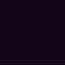

# Nightshade

A dark theme built around a deep-purple canvas (`#130518`) with teal (`#1ba891`) and pink
(`#e91e63`) accents. Syntax colors lean into cyan, lavender, and pink for a calm, high-contrast
read that's easy on the eyes during long sessions.

## Preview

<!--
  Add more language shots below as you capture them, e.g.:
  
  
-->

## Activate the theme

Once the extension is installed:

1. Open the Command Palette (`Ctrl+Shift+P`, or `Cmd+Shift+P` on macOS).
2. Run **Preferences: Color Theme**.
3. Select **Nightshade** from the list.

That's it, the theme applies instantly. You can switch back the same way anytime.

## What you get

- A consistent look across many languages, including JavaScript/TypeScript, Python, Go, Rust,
  PHP, HTML, CSS/SCSS, JSON, and Markdown.
- Fully themed editor and workbench: sidebar, panels, terminal, lists, menus, tooltips,
  bracket-pair colors, selection and find highlights, and git decorations.
- High-contrast syntax highlighting tuned for readability rather than noise.

## Palette

The core colors that define the look (syntax highlighting uses a few more accent shades on top of these):

| Role                   | Color     |
|------------------------|-----------|
| Background             | `#130518` |
| Foreground             | `#eeffff` |
| Accent (teal)          | `#1ba891` |
| Accent (pink)          | `#e91e63` |
| Keywords               | `#748bcf` |
| Storage / declarations | `#e1b5f8` |
| Functions              | `#08dde4` |
| Types / classes        | `#1ba891` |
| Strings                | `#e2c9ea` |
| Numbers                | `#5b8cf0` |
| Constants              | `#9d86ff` |
| Comments               | `#797979` |

## Feedback

Spot a scope that could look better, or a language that needs some love? Head to the
[issue tracker](https://github.com/WinningSoftwareDev/vscode-theme-nightshade/issues) and include
the language plus a short snippet so it can be reproduced and fixed.

**Enjoy!**
